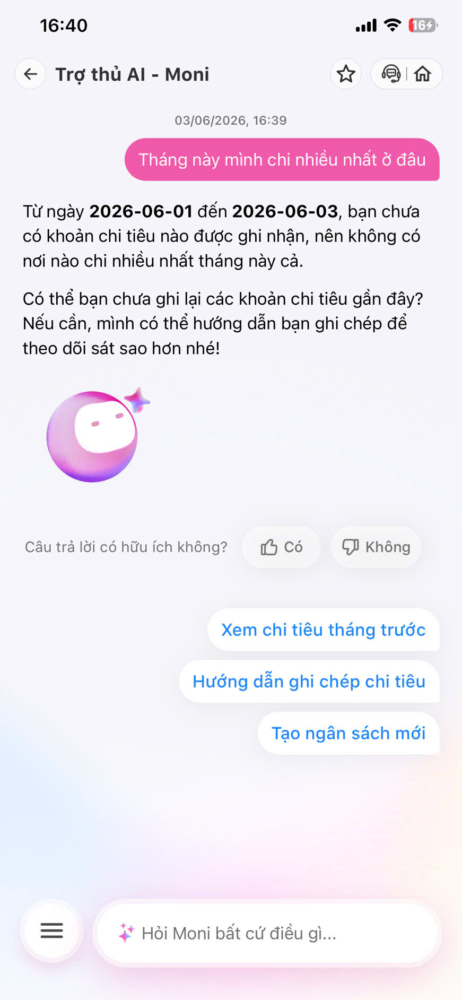
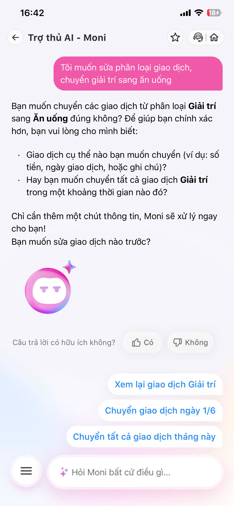
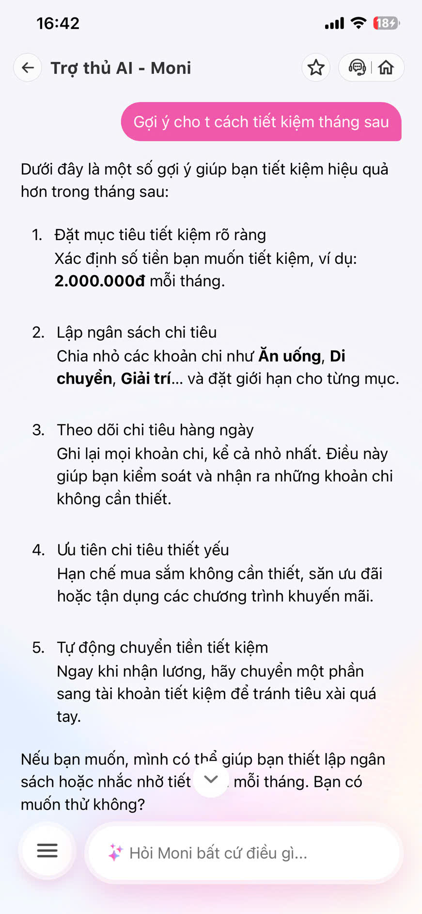

# Workshop — Mổ App AI Thật
---

**Thời gian:** 35-45 phút
**Hình thức:** cá nhân trước, chia sẻ theo nhóm sau
**Output:** finding note + sketch `as-is / to-be`

Mục tiêu không phải chấm "UI đẹp hay xấu". Mục tiêu là dùng sản phẩm thật như một bài needfinding: tìm chỗ product gãy trong workflow thật, rồi viết finding đó thành quyết định product.

## 1. Chọn một sản phẩm để dùng thử

| Sản phẩm | AI feature | Cách truy cập |
|---|---|---|
| MoMo — Moni | Trợ lý tài chính, phân tích chi tiêu, chatbot | App MoMo |

## 2. Dùng thử: promise vs reality

Ghi nhanh:

- **Product hứa gì?** Trợ lý AI quản lý tài chính cá nhân, tự động phân loại giao dịch, phân tích xu hướng chi tiêu và đưa ra gợi ý tiết kiệm phù hợp.
- **User nào được hứa sẽ được giúp?** Người dùng ví MoMo muốn theo dõi chi tiêu hằng tháng mà không cần tự ghi chép thủ công.
- **Bạn kỳ vọng AI làm được task nào?** Tự động pull lịch sử giao dịch từ ví MoMo, phân loại đúng, và trả lời câu hỏi "tháng này mình chi nhiều nhất ở đâu?" bằng dữ liệu thật.
- **Khi dùng thật, điểm gãy xuất hiện ở đâu?** **3 điểm gãy lớn:**
  1. **Data layer:** Moni KHÔNG tự truy xuất lịch sử giao dịch từ ví MoMo. User hỏi "tháng này mình chi nhiều nhất ở đâu?", Moni trả lời "bạn chưa có giao dịch nào" — dù user đã giao dịch bình thường trên MoMo.
  2. **Personalization:** Moni đưa 5 tips generic ("Đặt mục tiêu tiết kiệm rõ ràng", "Lập ngân sách chi tiêu") thay vì phân tích pattern chi tiêu thật của user.
  3. **Category transfer:** Moni hiểu được yêu cầu chuyển category, nhưng phải hỏi lại 3 lần mới xác nhận được — không có bulk action.

Evidence cần có:

- **Screenshot 1:** Moni trả lời "Từ ngày 2026-06-01 đến 2026-06-03, bạn chưa có giao dịch nào được ghi nhận" — trong khi user đã giao dịch trên MoMo.
  

- **Screenshot 2:** Moni hỏi lại "bạn muốn chuyển giao dịch nào?" khi user yêu cầu chuyển category — low-confidence path hoạt động nhưng quá dài dòng.
  

- **Screenshot 3:** Moni đưa 5 tips generic, không dựa trên bất kỳ dữ liệu chi tiêu nào của user.
  

- **Prompt đã thử:**
  1. *"Tháng này mình chi nhiều nhất ở đâu?"*
  2. *"Tôi muốn sửa phân loại giao dịch, chuyển mục Giải trí sang Ăn uống"*
  3. *"Gợi ý cho tôi cách tiết kiệm tháng sau"*
- **Hành vi quan sát được:** User kỳ vọng Moni tự pull data từ ví MoMo (vì cùng là hệ sinh thái MoMo), nhưng Moni hoạt động như một chatbot biệt lập, không có quyền truy cập dữ liệu giao dịch thật. User phải tự ghi chép lại từ đầu — đúng nghĩa đen "trợ lý tài chính" nhưng không biết user đang chi gì.

## 3. Vẽ 4 paths

| Path | Câu hỏi cần trả lời / Kịch bản áp dụng trên MoMo Moni |
|---|---|
| **Happy** | Khi Moni có data và hiểu đúng: User hỏi "tháng này chi nhiều nhất ở đâu?", Moni trả lời *"Ăn uống: 2.8tr (45%). Nhiều hơn tháng trước 12%."* — số liệu chính xác, user ra quyết định ngay. **(Chưa xảy ra trong thực tế — Moni chưa tự pull data.)** |
| **Low-confidence** | Khi user yêu cầu chuyển category "Giải trí → Ăn uống": Moni hỏi lại *"Bạn muốn chuyển giao dịch nào?"* kèm 3 chips [Xem tất cả giao dịch Giải trí], [Chuyển giao dịch ngày 1/6], [Chuyển tất cả giao dịch tháng này]. **(Có hoạt động — nhưng cần 2-3 lần hỏi lại.)** |
| **Failure** | **(As-is hiện tại)** Moni KHÔNG truy xuất được lịch sử giao dịch MoMo. Khi user hỏi phân tích chi tiêu, Moni trả lời "chưa có giao dịch nào" và đề nghị ghi chép thủ công. User bị mất trust hoàn toàn. |
| **Correction** | Khi user yêu cầu chuyển category, Moni hiểu được và hỏi xác nhận. **Tuy nhiên:** correction chỉ trong session, không lưu pattern để cải thiện lần sau. User sửa 10 lần vẫn phải sửa lại từ đầu tháng sau. |

## 4. Viết finding thành quyết định

```text
Khi user kỳ vọng Moni (trợ lý AI trong app MoMo) tự động truy xuất lịch sử giao dịch từ ví MoMo,
AI/product KHÔNG có quyền truy cập dữ liệu giao dịch thật (Data Access Gap),
hậu quả là Moni hoạt động như chatbot biệt lập — trả lời "chưa có giao dịch" dù user đã giao dịch bình thường,
và đưa ra generic advice ("Đặt mục tiêu tiết kiệm", "Lập ngân sách") hoàn toàn không contextual.
Lỗi thuộc layer Data-tool (không kết nối API giao dịch) và Promise (marketing hứa "phân tích chi tiêu" nhưng không có data).
Nên sửa bằng:
1. Kết nối API giao dịch MoMo vào Moni: Moni cần đọc được lịch sử giao dịch thật của user để phân tích.
2. Nếu chưa kết nối được API, phải communicate rõ ràng: "Moni chưa kết nối được dữ liệu giao dịch. Bạn có muốn nhập thủ công?"
3. Generic advice phải có fallback contextual: Thay vì "Đặt mục tiêu tiết kiệm rõ ràng", nói "Bạn chưa có dữ liệu chi tiêu. Để mình phân tích, bạn cần cho mình biết các khoản chi gần đây."
```

## 5. Sketch as-is / to-be

### AS-IS FLOW (Hiện trạng — Điểm gãy)

```
👤 User: "Tháng này mình chi nhiều nhất ở đâu?"
   │
   ▼
🤖 Moni (Logic): Query database → KHÔNG CÓ DATA giao dịch
   │             => Moni không kết nối API MoMo transaction.
   │             => Trả về template response mặc định.
   ▼
📱 Giao diện trả về (Dead-end):
┌─────────────────────────────────────────────────┐
│ Moni: Từ ngày 2026-06-01 đến 2026-06-03,       │
│ bạn chưa có giao dịch nào được ghi nhận.        │
│                                                 │
│ Nếu cần, mình có thể hướng dẫn bạn              │
│ ghi lại các khoản chi tiêu gần đây.            │
│                                                 │
│ [Xem chi tiêu tháng trước]                     │
│ [Hướng dẫn ghi chép chi tiêu]                  │
│ [Tạo ngân sách mới]                            │
└─────────────────────────────────────────────────┘
   │
   ✖ User hiểu lầm: "Mình đã giao dịch nhiều rồi, sao nó nói chưa có?"
   ✖ User phải tự ghi chép lại từ đầu.
   ✖ Moni không thể phân tích gì cả.
```

---

### TO-BE FLOW (Đề xuất giải pháp)

```
👤 User: "Tháng này mình chi nhiều nhất ở đâu?"
   │
   ▼
🤖 Moni (Logic): Query MoMo Transaction API → CÓ DATA
   │             => Phân loại tự động (ăn uống, giải trí, mua sắm...)
   │             => Nếu confidence < 0.7 → hiển thị chip xác nhận.
   │             => Nếu confidence >= 0.7 → phân tích luôn.
   ▼
📱 Giao diện kết quả (Data-driven):
┌─────────────────────────────────────────────────┐
│ 💰 Chi tiêu từ 01/06 - 03/06: 850.000đ        │
│                                                 │
│ 🍜 Ăn uống: 450.000đ (53%)  ████████████       │
│ 🚗 Di chuyển: 200.000đ (24%) █████            │
│ ❓ Chưa phân loại: 200.000đ (23%)              │
│                                                 │
│ ⚠️ Có 200.000đ chưa xác nhận category.         │
│    Bạn muốn phân loại không?                    │
│                                                 │
│ [ Phân loại ngay ]    [ Bỏ qua ]               │
│                                                 │
│ 💡 Moni: "Ăn uống chiếm tỷ lệ lớn nhất.         │
│    Bạn có muốn đặt ngân sách ăn uống           │
│    cho tháng sau không?"                       │
└─────────────────────────────────────────────────┘
   │
   ✓ Moni có data thật → phân tích chính xác.
   ✓ Giao dịch chưa phân loại được đánh dấu rõ ràng.
   ✓ Advice contextual dựa trên pattern thật.
```

## 6. Tự kiểm trước khi nộp

- [x] Có ít nhất 1 screenshot hoặc observation cụ thể. (3 screenshots thật từ Moni)
- [x] Có đủ 4 paths hoặc nói rõ path nào chưa có trong product. (Happy path chưa xảy ra — Moni chưa tự pull data)
- [x] Finding được viết thành product decision, không chỉ là nhận xét.
- [x] Sketch có as-is và to-be.
- [x] Có một câu nói rõ finding này sẽ đổi gì trong SPEC.

**Product Decision:**
```
SPEC yêu cầu: Moni PHẢI kết nối MoMo Transaction API để tự động đọc lịch sử giao dịch của user.
Hiện tại Moni hoạt động như chatbot biệt lập — không có quyền truy cập dữ liệu giao dịch thật.
Đây là gap lớn nhất giữa promise ("trợ lý tài chính AI phân tích chi tiêu") và reality (chatbot generic không biết user chi gì).

Thay đổi cụ thể trong SPEC:
1. Data layer: Thêm OAuth/MoMo Transaction API integration — Moni phải đọc được lịch sử giao dịch.
2. Category logic: Confidence threshold 0.7 — dưới ngưỡng hiển thị chip xác nhận.
3. Advice engine: Generic advice chỉ dùng khi KHÔNG CÓ data. Khi CÓ data, phải contextual.
4. Correction loop: User sửa category → lưu pattern → cải thiện lần sau.
```
