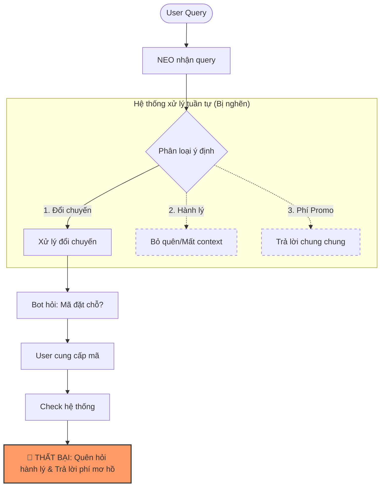
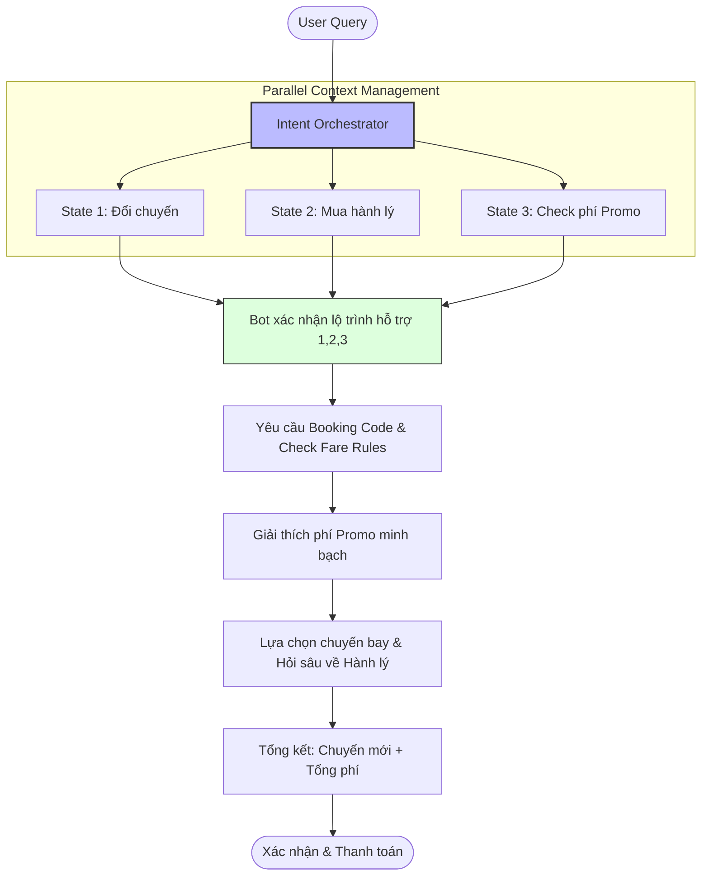

# ✈️ AI Product Audit – NEO Vietnam Airlines

## 📋 1. Scenario Test

**User Query:**
> 💬 *“Chuyến SGN-HAN mai của mình bị đổi giờ, mình muốn đổi sang chuyến tối hơn và mua thêm 20kg hành lý luôn, nhưng vé mình là promo thì có mất phí không?”*

---

## 🔄 2. Phân tích Flow Hiện tại (AS-IS)

### 🎯 Mục tiêu Test
Flow này dùng để kiểm tra các khả năng cốt lõi của hệ thống:
*   **Multi-intent handling:** Xử lý đa ý định trong một câu.
*   **Policy reasoning:** Tư duy logic dựa trên chính sách.
*   **Context memory:** Ghi nhớ ngữ cảnh hội thoại.
*   **Tool orchestration:** Điều phối các công cụ hỗ trợ.
*   **Conversational UX:** Trải nghiệm người dùng khi trò chuyện.
*   **Trust & explainability:** Độ tin cậy và khả năng giải trình.

---

### ❌ AS-IS FLOW (Luồng hiện tại - Dễ thất bại)



---

### ⚠️ Điểm yếu trải nghiệm (Pain Points)

| Giai đoạn | Điểm đứt gãy | Tác động |
| :--- | :--- | :--- |
| **Intent detection** | Xử lý đa ý định yếu | Bỏ sót yêu cầu của khách |
| **Policy reasoning** | Trả lời mơ hồ | Gây hoang mang cho khách |
| **Context memory** | Quên intent "mua hành lý" | Khách phải nhắc lại nhiều lần |
| **Conversational UX** | Flow bị phân mảnh | User cảm thấy bực bội (Frustrated) |
| **Trust** | Thiếu dẫn chứng chính sách | Giảm độ tin cậy vào hệ thống |

---

## 🧠 3. Quản lý trạng thái (State Management)

Các trạng thái (states) cần được duy trì song song:
1.  **State 1:** Đổi chuyến bay (Change Flight)
2.  **State 2:** Mua hành lý (Add Baggage)
3.  **State 3:** Kiểm tra phí Promo (Fare Rule Check)

> 💡 **Vấn đề:** Hiện tại chatbot Airline rất dễ bị **overwrite state** (chỉ giữ cái cuối) hoặc mất hoàn toàn ngữ cảnh khi chuyển đổi giữa các bước.

---

## 🚀 4. Đề xuất cải tiến (TO-BE FLOW)

### ✅ TO-BE FLOW (Luồng tối ưu)



---

### ✨ Những cải thiện chính

| Vấn đề cũ | Giải pháp mới | Giá trị mang lại |
| :--- | :--- | :--- |
| Mất ý định | **Intent Orchestration** | Xử lý trọn vẹn mọi yêu cầu |
| Chính sách mơ hồ | **Explainable Policy** | Minh bạch, dễ hiểu |
| Quên ngữ cảnh | **State Tracking** | Hội thoại mượt mà, không lặp lại |
| UX rời rạc | **Guided Flow** | Dẫn dắt người dùng từng bước |
| Thiếu tin cậy | **Fee Breakdown** | Chi tiết hóa từng khoản phí |

---

## 🛠️ Đề xuất kỹ thuật cụ thể

### 1️⃣ Intent Queue
Hệ thống cần một hàng đợi ý định để đảm bảo không bỏ sót:
```json
{
  "current_intents": ["change_flight", "add_baggage", "promo_fee_question"],
  "status": "in_progress"
}
```

### 2️⃣ Confidence-based Clarification
Nếu độ tin cậy thấp, bot nên chủ động hỏi lại:
> 🗣️ *"Anh/chị muốn đổi toàn bộ hành trình hay chỉ chiều SGN → HAN ạ?"*

### 3️⃣ Policy Grounding
Mỗi câu trả lời về chính sách cần:
*   Dẫn nguồn nội bộ (Internal Source).
*   Ngày hiệu lực (Effective Date).
*   Giải thích ngắn gọn, dễ hiểu.

### 4️⃣ Conversation Summary Block
Tóm tắt sau mỗi bước lớn để tránh mất dấu:
> ✅ Đã chọn chuyến bay mới.  
> ⏳ Đang xử lý mua thêm hành lý...  
> ⏳ Đang tính phí tổng hợp.

---

## 🏁 Kết luận

*   **Root Cause:** Hệ thống hiện tại yếu về điều phối ý định (Orchestration) và quản lý trạng thái (State Management).
*   **Giải pháp then chốt:** Triển khai **Intent Orchestration + State Tracking + Explainable Policy**.
*   **Impact:** Tăng tỷ lệ hoàn thành tác vụ, giảm sự phụ thuộc vào nhân viên hỗ trợ và xây dựng niềm tin nơi khách hàng.

---
*Created by AI Product Audit Team*
