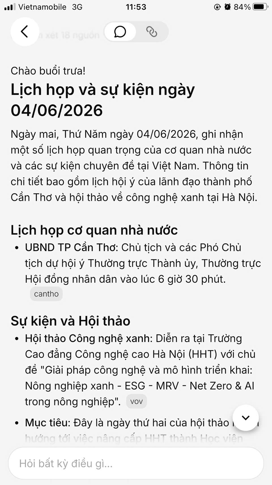

# Workshop — Mổ App AI Thật
---

**Thời gian:** 35-45 phút  
**Hình thức:** cá nhân trước, chia sẻ theo nhóm sau  
**Output:** finding note + sketch `as-is / to-be`

Mục tiêu không phải chấm "UI đẹp hay xấu". Mục tiêu là dùng sản phẩm thật như một bài needfinding: tìm chỗ product gãy trong workflow thật, rồi viết finding đó thành quyết định product.

## 1. Chọn một sản phẩm để dùng thử

| Sản phẩm | AI feature | Cách truy cập |
|---|---|---|
| V-App — V-AI | Trợ lý voice/text, gợi ý theo ngữ cảnh | App V-App |

## 2. Dùng thử: promise vs reality

Ghi nhanh:

- **Product hứa gì?** Trợ lý ảo gợi ý chính xác theo ngữ cảnh cá nhân/công việc.
- **User nào được hứa sẽ được giúp?** Người dùng bận rộn cần truy xuất thông tin công việc/cá nhân nhanh chóng bằng ngôn ngữ tự nhiên.
- **Bạn kỳ vọng AI làm được task nào?** Hiểu được sự thay đổi ngữ cảnh hội thoại đột ngột ("à quên") và truy xuất đúng lịch họp cá nhân vào ngày mai.
- **Khi dùng thật, điểm gãy xuất hiện ở đâu?** Hệ thống nhận diện sai phạm vi dữ liệu (Data Scope). Thay vì truy xuất dữ liệu Calendar cá nhân, V-AI lại kích hoạt Web Search, hiểu "lịch họp" theo nghĩa đại chúng và trả về các tin tức sự kiện không liên quan.

Evidence cần có:

- **Screenshot:** (Hiển thị V-AI trả về kết quả lịch họp UBND TP Cần Thơ, sự kiện công nghệ xanh thay vì lịch cá nhân).



- **Prompt/input đã thử:** *"Mở cho tôi báo cáo tháng này... à quên, tìm lịch họp ngày mai trước đi"*
- **Hành vi quan sát được:** Người dùng bị "ngợp" thông tin rác và quy trình truy xuất lịch làm việc bị đứt gãy hoàn toàn.

## 3. Vẽ 4 paths

| Path | Câu hỏi cần trả lời / Kịch bản áp dụng trên V-AI |
|---|---|
| **Happy** | Khi AI nhận ra từ "lịch họp" thuộc bối cảnh cá nhân, nó tự động kết nối API Calendar và trả về: *"Ngày mai bạn có 1 lịch họp lúc 9h sáng."* |
| **Low-confidence** | Khi AI không chắc chắn "lịch họp" là cá nhân hay tin tức: Hệ thống tạm dừng, hiển thị Suggestion Chips `[Lịch cá nhân]` hoặc `[Sự kiện nổi bật]` để user chủ động chọn. |
| **Failure** | (As-is hiện tại) Khi AI tự tin đưa ra quyết định sai: Kích hoạt Web Search và đổ ra một màn hình dài đặc chữ về sự kiện nhà nước, ép user phải tự nhận ra bot hiểu sai. |
| **Correction** | Khi user phản hồi *"Không, lịch họp của tôi cơ mà!"*, AI ghi nhận lỗi (log), xin lỗi và chuyển hướng luồng tìm kiếm sang tool Calendar nội bộ. |

## 4. Viết finding thành quyết định

```text
Khi user yêu cầu truy xuất thông tin mang tính cá nhân hóa nhưng sử dụng từ khóa chung chung (như "lịch họp"),
AI/product nhận diện sai phạm vi tìm kiếm (Data Scope) và kích hoạt công cụ Web Search thay vì Personal Calendar,
hậu quả là user bị ngợp bởi thông tin không liên quan (lịch họp nhà nước) và tác vụ thất bại.
Lỗi thuộc layer Intent Mapping (Phân loại ý định) và Data-tool selection.
Nên sửa bằng low-confidence path: Khi query thiếu định danh sở hữu rõ ràng, bot cần hiển thị các nút Suggestion Chips ngay dưới câu lệnh để user chọn ngữ cảnh [Lịch cá nhân] hoặc [Tin tức sự kiện] trước khi xuất kết quả.
```

## 5. Sketch as-is / to-be

### 💥 AS-IS FLOW (Hiện trạng - Điểm gãy)
```mermaid
👤 User: "Mở báo cáo... à quên, tìm lịch họp ngày mai trước đi"
   │
   ▼
🤖 V-AI (Logic): Không tìm thấy từ khóa định danh ("của tôi") 
   │             => Tự tin dự đoán sai Intent.
   │             => Mặc định [Gọi Web Search API].
   ▼
📱 Giao diện trả về (Dead-end):
┌─────────────────────────────────────────────────────┐
│ V-AI: Chào buổi trưa! Lịch họp ngày 04/06...        │
│                                                     │
│ 📰 Lịch họp cơ quan nhà nước                        │
│ - UBND TP Cần Thơ: Chủ tịch dự hội ý...             │
│                                                     │
│ 📰 Sự kiện và Hội thảo                              │
│ - Hội thảo công nghệ xanh tại Hà Nội...             │
│                                                     │
│ (User bị ngợp thông tin, không có nút thoát/sửa)    │
└─────────────────────────────────────────────────────┘
   │
   ✖ Drop-off: User phải tự gõ lại từ đầu hoặc bỏ ngang tác vụ.
```

### 💡 TO-BE FLOW (Đề xuất giải pháp)
```mermaid
👤 User: "Mở báo cáo... à quên, tìm lịch họp ngày mai trước đi"
   │
   ▼
🤖 V-AI (Logic): Không tìm thấy từ khóa định danh ("của tôi") 
   │             => Đánh giá Low-confidence (Độ tự tin thấp).
   │             => Kích hoạt [Fallback UI Routing].
   ▼
📱 Giao diện trả về (UX Recovery):
┌─────────────────────────────────────────────────────┐
│ V-AI: Bạn muốn tìm lịch trình cá nhân của bạn hay   │
│ xem các sự kiện nổi bật ngày mai?                   │
│                                                     │
│   [ 🔘 Lịch cá nhân ]      [ 🔘 Tin tức sự kiện ]   │
└─────────────────────────────────────────────────────┘
   │
   ▼ (User chủ động click chọn)
👆 User click: [ 🔘 Lịch cá nhân ]
   │
   ▼
🤖 V-AI (Logic): Nhận Intent chính xác => [Gọi Calendar API].
   ▼
📱 Giao diện kết quả (Tác vụ thành công):
┌─────────────────────────────────────────────────────┐
│ V-AI: Dưới đây là lịch trình của bạn ngày mai:      │
│                                                     │
│ 📅 09:00 AM - Họp nhóm dự án                        │
│ 📅 14:00 PM - Gặp khách hàng đối tác                │
└─────────────────────────────────────────────────────┘
```

## 6. Tự kiểm trước khi nộp

- [x] Có ít nhất 1 screenshot hoặc observation cụ thể.
- [x] Có đủ 4 paths hoặc nói rõ path nào chưa có trong product.
- [x] Finding được viết thành product decision, không chỉ là nhận xét.
- [x] Sketch có as-is và to-be.
- [x] Có một câu nói rõ finding này sẽ đổi gì trong SPEC.

**Product Decision:** 

```text
Bổ sung logic routing (định tuyến) vào SPEC: Khi Intent (Ý định) của người dùng là 'Truy vấn lịch trình' nhưng thiếu Entity sở hữu rõ ràng (ví dụ: thiếu từ khóa 'của tôi', 'phòng ban'), hệ thống không được mặc định gọi Web Search API. Thay vào đó, bắt buộc kích hoạt Fallback UI: Hiển thị câu hỏi xác nhận kèm 2 Suggestion Chips (Lịch cá nhân / Sự kiện công cộng) để người dùng chủ động điều hướng luồng dữ liệu.
```