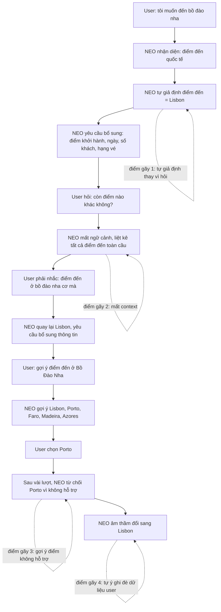
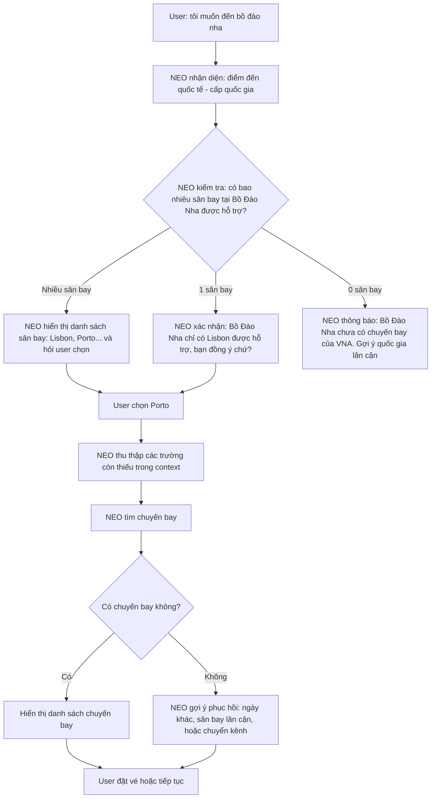
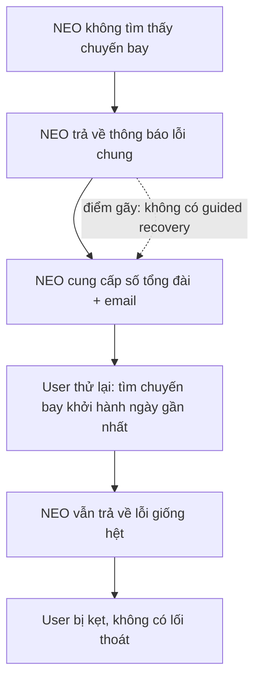
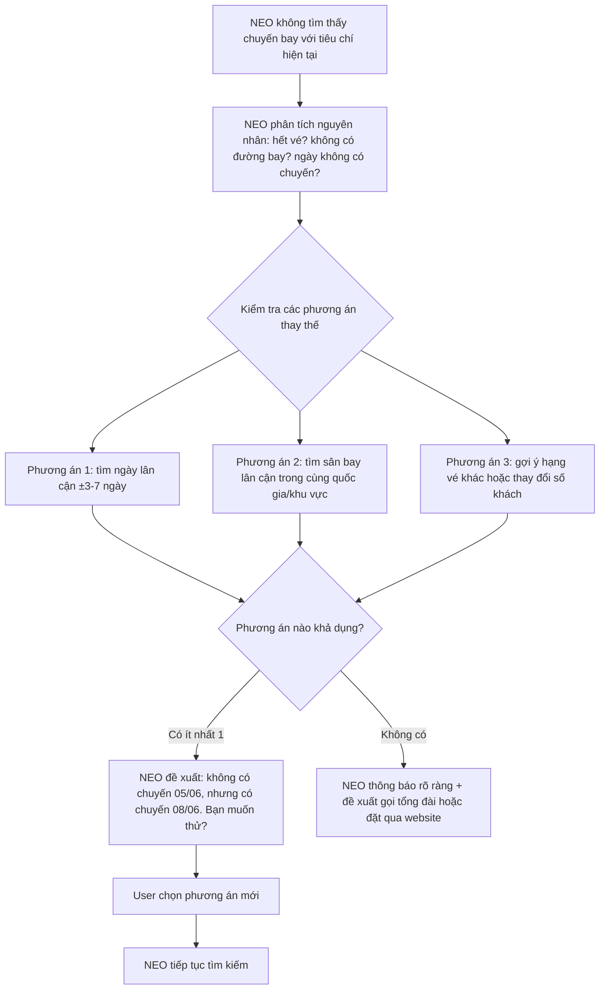
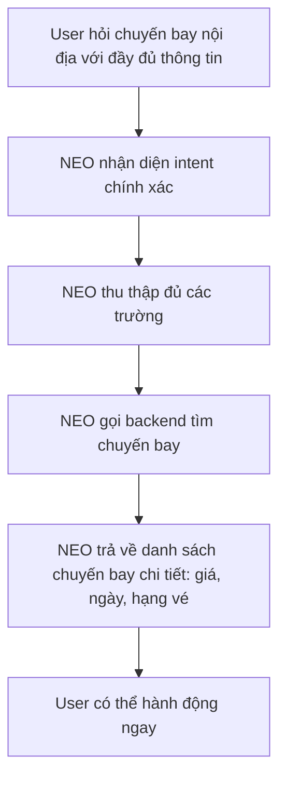
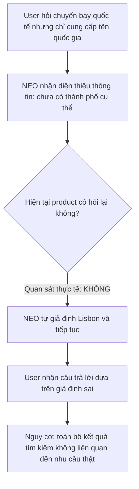
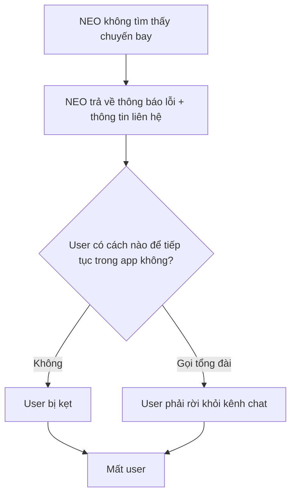
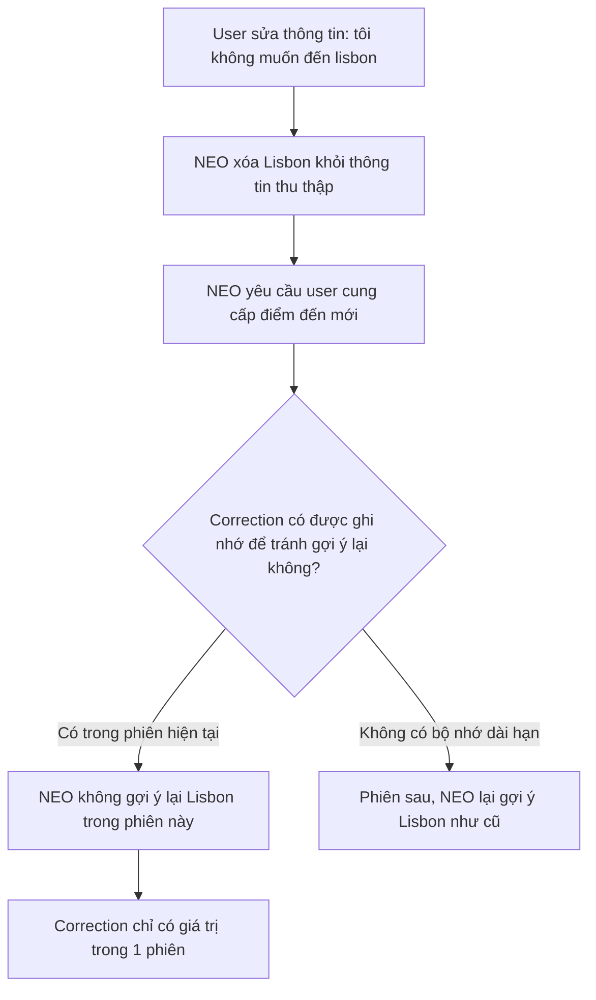

# Workshop — Mổ App AI Thật

**Sản phẩm được chọn:** Vietnam Airlines — NEO
**AI feature:** Chatbot hỗ trợ vé, hành lý, khiếu nại
**Thời gian thực hiện:** 35-45 phút
**Hình thức:** cá nhân trước, chia sẻ theo nhóm sau
**Output:** finding note + sketch `as-is / to-be`

Mục tiêu không phải chấm "UI đẹp hay xấu". Mục tiêu là dùng sản phẩm thật như một bài needfinding: tìm chỗ product gãy trong workflow thật, rồi viết finding đó thành quyết định product.

---

## 1. Chọn một sản phẩm để dùng thử

| Sản phẩm               | AI feature                                     | Cách truy cập       |
| ---------------------- | ---------------------------------------------- | ------------------- |
| MoMo — Moni            | Trợ thủ tài chính, phân tích chi tiêu, chatbot | App MoMo            |
| **Vietnam Airlines — NEO** | **Chatbot hỗ trợ vé, hành lý, khiếu nại** | **Website/Zalo VNA** |
| V-App — V-AI           | Trợ lý voice/text, gợi ý theo ngữ cảnh         | App V-App           |
| App theo track nhóm    | App thật nhóm đang chọn cho hackathon          | Cần screenshot/link |

**Sản phẩm được chọn:** Vietnam Airlines — NEO.

**Lý do chọn:**
NEO được định vị là trợ lý ảo chính thức của Vietnam Airlines, hỗ trợ khách hàng tra cứu vé, hành lý và khiếu nại qua kênh chat. Vì là chatbot của hãng hàng không quốc gia, kỳ vọng NEO không chỉ hiểu ngôn ngữ tự nhiên tiếng Việt mà còn phải xử lý được các tác vụ đặt vé phức tạp như: gợi ý điểm đến, kiểm tra giá vé theo ngày, hỗ trợ hành trình quốc tế với nhiều điểm đến, và có khả năng phục hồi khi không tìm thấy kết quả.

---

## 2. Dùng thử: promise vs reality

### 2.1. Product hứa gì?

NEO được kỳ vọng là một trợ lý ảo có thể:

* Hỗ trợ khách hàng tra cứu chuyến bay nội địa và quốc tế.
* Thu thập thông tin từng bước (điểm đi, điểm đến, ngày, số khách, hạng vé).
* Gợi ý điểm đến khi người dùng chưa xác định rõ.
* Tìm chuyến bay theo các tiêu chí người dùng yêu cầu.
* Cung cấp thông tin liên hệ khi cần hỗ trợ thêm.

### 2.2. User nào được hứa sẽ được giúp?

Nhóm user chính:

* Hành khách Vietnam Airlines muốn tra cứu chuyến bay.
* Người dùng Zalo/Website Vietnam Airlines.
* Khách hàng cần hỗ trợ về vé, hành lý, khiếu nại.
* Người dùng phổ thông, chưa có kinh nghiệm đặt vé máy bay.

### 2.3. Kỳ vọng AI làm được task nào?

Tôi kỳ vọng NEO có thể làm tốt các task sau:

1. **Tìm kiếm chuyến bay quốc tế**

   * Hiểu điểm đến khi người dùng chỉ cung cấp tên quốc gia.
   * Gợi ý các sân bay cụ thể trong quốc gia đó.
   * Duy trì các thông tin đã thu thập khi hội thoại chuyển hướng.
   * Tìm được chuyến bay hoặc đưa ra phương án thay thế nếu không có.

2. **Duy trì ngữ cảnh hội thoại**

   * Ghi nhớ điểm đến người dùng đã chọn.
   * Không tự ý thay đổi thông tin đã xác nhận.
   * Khi người dùng hỏi "còn điểm nào khác", trả lời trong phạm vi ngữ cảnh hiện tại (cùng quốc gia/khu vực).

3. **Xử lý khi không tìm thấy chuyến bay**

   * Gợi ý ngày khác, sân bay lân cận, hoặc hạng vé khác.
   * Không chỉ trả về thông báo lỗi rồi kết thúc.

---

## 2.4. Prompt/input đã thử

### Query 1 — Đến Bồ Đào Nha, chưa xác định thành phố

```text
tôi muốn đến bồ đào nha
```

### Query 2 — Hỏi điểm đến khác trong ngữ cảnh Bồ Đào Nha

```text
còn điểm nào khác không?
điểm đến ở bồ đào nha cơ mà
tôi muốn đến điểm khác ở bồ đào nha
tôi ko biết bồ đào nha có những điểm đến nào, gợi ý nhiều điểm đến giúp tôi đi
```

### Query 3 — Tìm chuyến bay cụ thể

```text
đi từ hà nội, đến porto, đi ngày nào có giá vé rẻ nhất, đi 1 người lớn
2 hôm nữa
```

### Query 4 — Khi không tìm thấy chuyến bay

```text
thế tìm cho tôi chuyến bay nào khởi hành ngày gần nhất đi
```

### Query 5 — Chuyển sang chuyến bay nội địa

```text
tôi muốn đến sài gòn
ngày gần nhất
```

---

## 2.5. Hành vi quan sát được

### Observation 1 — NEO mất ngữ cảnh hội thoại

Khi người dùng đang trong ngữ cảnh tìm điểm đến tại Bồ Đào Nha và hỏi "còn điểm nào khác không?", NEO trả lời bằng danh sách tất cả điểm đến nội địa và quốc tế của Vietnam Airlines (Hà Nội, Đà Nẵng, Singapore, London, Paris...), hoàn toàn không liên quan đến Bồ Đào Nha. Người dùng phải nhắc lại "điểm đến ở bồ đào nha cơ mà" thì NEO mới quay lại đúng ngữ cảnh.

**Điểm gãy:** Chatbot không duy trì được context window — phản hồi như thể mỗi câu hỏi là một phiên mới.

---

### Observation 2 — NEO tự mâu thuẫn về điểm đến được hỗ trợ

Khi người dùng yêu cầu gợi ý điểm đến tại Bồ Đào Nha, NEO liệt kê: Lisbon, Porto, Faro, Madeira, Azores. Người dùng chọn Porto. Tuy nhiên, sau khi thu thập đủ thông tin, NEO từ chối Porto với lý do: "Porto không nằm trong danh sách sân bay được hỗ trợ". NEO sau đó âm thầm đổi điểm đến thành Lisbon mà không thông báo hay giải thích.

**Điểm gãy:** Hệ thống gợi ý điểm đến và hệ thống tìm chuyến bay dùng hai bộ dữ liệu khác nhau, không đồng bộ. Hành vi tự ý thay đổi thông tin người dùng làm xói mòn lòng tin.

---

### Observation 3 — Không có cơ chế phục hồi khi không tìm thấy chuyến bay

Sau khi NEO tự đổi điểm đến thành Lisbon và người dùng xác nhận, NEO trả về: "NEO không tìm thấy chuyến bay phù hợp". Khi người dùng thử lại với yêu cầu "tìm chuyến bay khởi hành ngày gần nhất", NEO tiếp tục trả về thông báo lỗi giống hệt kèm số điện thoại tổng đài. Không có gợi ý về ngày khác, sân bay lân cận, hay hạng vé khác.

**Điểm gãy:** Failure path là dead end — không có nhánh phục hồi, không gợi ý phương án B.

---

### Observation 4 — Chất lượng phản hồi không đồng đều giữa nội địa và quốc tế

Khi không tìm thấy chuyến bay quốc tế, NEO chỉ trả về thông báo lỗi chung chung. Nhưng khi người dùng hỏi chuyến bay nội địa ("tôi muốn đến sài gòn"), NEO lập tức trả về danh sách chi tiết gồm điểm khởi hành, ngày bay, giá vé cho cả hạng Thương gia và Phổ thông — rất ấn tượng. Tuy nhiên, khi hỏi "ngày gần nhất", NEO lại không lọc được mà chỉ dẫn về website.

**Điểm gãy:** Trải nghiệm không nhất quán — người dùng không biết khi nào NEO sẽ hoạt động tốt và khi nào sẽ thất bại.

---

### Observation 5 — Thu thập thông tin tốt nhưng thiếu xác nhận giả định

NEO chủ động thu thập từng trường thông tin (điểm khởi hành, ngày đi, loại vé, số khách, hạng vé) và hiển thị trạng thái "đã thu thập được". Đây là điểm tốt. Tuy nhiên, khi người dùng chỉ nói "tôi muốn đến bồ đào nha", NEO lập tức giả định điểm đến là Lisbon mà không hỏi người dùng muốn đến thành phố nào.

**Điểm gãy:** AI tự điền giả định (Lisbon) thay vì hỏi lại, dẫn đến luồng hội thoại sai hướng ngay từ đầu.

---

## 3. Vẽ 4 paths

| Path           | Câu hỏi cần trả lời                                                           | Quan sát trên NEO                                                                                                                              |
| -------------- | ----------------------------------------------------------------------------- | ---------------------------------------------------------------------------------------------------------------------------------------------- |
| Happy          | Khi AI đúng và tự tin, user thấy gì?                                          | NEO trả về danh sách chuyến bay nội địa chi tiết có giá vé, ngày bay, hạng vé. Trải nghiệm mượt khi đủ dữ liệu và chuyến bay tồn tại.          |
| Low-confidence | Khi AI không chắc, hệ thống có hỏi lại, show options hoặc chuyển người không? | NEO có hỏi lại các trường còn thiếu, nhưng khi thiếu điểm đến cụ thể trong một quốc gia, NEO tự giả định thay vì hỏi. Chưa có low-confidence path rõ ràng. |
| Failure        | Khi AI sai, user biết bằng cách nào và sửa thế nào?                           | Khi không tìm thấy chuyến bay, NEO chỉ thông báo lỗi + số tổng đài. Không có gợi ý thay thế, không có cách sửa. User bị kẹt hoàn toàn.         |
| Correction     | Khi user sửa, correction có được lưu/log/học lại không hay biến mất?          | Khi user nói "tôi không muốn đến lisbon", NEO xóa Lisbon khỏi thông tin thu thập nhưng không ghi nhớ để tránh gợi ý lại. Correction chỉ tồn tại trong phiên, không có bộ nhớ dài hạn. |

---

# 4. Finding thành quyết định product

## Finding 1 — Mất ngữ cảnh hội thoại (Context Window)

```text
Khi người dùng đang hội thoại trong một ngữ cảnh cụ thể (ví dụ: tìm điểm đến tại Bồ Đào Nha) và hỏi một câu follow-up,
NEO phản hồi như thể mỗi câu là một phiên mới, mất hoàn toàn ngữ cảnh trước đó,
hậu quả là người dùng phải nhắc lại thông tin nhiều lần, gây frustration và kéo dài thời gian xử lý.
Lỗi thuộc layer Intent + Context Management.
Nên sửa bằng requirement: NEO phải duy trì context window tối thiểu 5-7 lượt hội thoại, mọi câu follow-up phải được hiểu trong ngữ cảnh của các câu trước.
```

**Product decision:**
NEO cần được trang bị cơ chế **conversation context management** — mỗi câu hỏi follow-up phải được đánh giá trong bối cảnh của toàn bộ phiên hội thoại, không xử lý độc lập.

---

## Finding 2 — Tự ý thay đổi dữ liệu người dùng (Silent Data Override)

```text
Khi NEO gợi ý Porto là một điểm đến và người dùng chọn Porto, nhưng hệ thống backend không hỗ trợ Porto,
NEO âm thầm đổi điểm đến thành Lisbon mà không thông báo hay xin xác nhận từ người dùng,
hậu quả là người dùng không biết thông tin đã bị thay đổi và có thể nhận kết quả không mong muốn.
Lỗi thuộc layer Data-tool + UX Recovery.
Nên sửa bằng requirement: khi hệ thống không hỗ trợ một lựa chọn từng được gợi ý, phải thông báo rõ ràng lý do và yêu cầu người dùng chọn lại, tuyệt đối không tự ý ghi đè.
```

**Product decision:**
NEO phải minh bạch với người dùng. Khi một điểm đến không khả dụng, phải giải thích "Porto hiện không có chuyến bay của Vietnam Airlines" thay vì lặng lẽ đổi sang Lisbon. Thêm vào đó, danh sách gợi ý điểm đến phải được đồng bộ với danh sách sân bay backend thực sự hỗ trợ.

---

## Finding 3 — Failure path là dead end

```text
Khi không tìm thấy chuyến bay, NEO chỉ trả về thông báo lỗi chung chung và số tổng đài,
không có bất kỳ gợi ý phục hồi nào như: ngày lân cận, sân bay lân cận, hạng vé khác, hoặc đặt vé qua kênh khác,
hậu quả là người dùng bị kẹt, không biết làm gì tiếp theo ngoài việc gọi điện hoặc rời bỏ.
Lỗi thuộc layer UX Recovery.
Nên sửa bằng requirement: mỗi failure response phải kèm theo ít nhất 2-3 phương án phục hồi được cá nhân hóa dựa trên thông tin đã thu thập.
```

**Product decision:**
Failure path phải được thiết kế như một **guided recovery flow**. Khi không tìm thấy chuyến bay, NEO cần chủ động đề xuất: "Không có chuyến bay ngày 05/06. Ngày gần nhất có chuyến là 08/06, bạn có muốn thử không?" hoặc "Lisbon không có chuyến, nhưng Madrid có chuyến ngày 05/06, bạn có quan tâm không?"

---

## Finding 4 — Giả định ẩn khi thiếu dữ liệu

```text
Khi người dùng chỉ nói "tôi muốn đến bồ đào nha", NEO lập tức giả định điểm đến là Lisbon mà không hỏi người dùng muốn thành phố nào,
hậu quả là hội thoại đi sai hướng ngay từ đầu và người dùng phải tốn nhiều lượt để sửa.
Lỗi thuộc layer Intent + Data-tool.
Nên sửa bằng requirement: khi thông tin đầu vào mơ hồ (quốc gia thay vì thành phố), NEO phải hỏi lại để làm rõ trước khi gán giá trị mặc định.
```

**Product decision:**
Khi người dùng cung cấp tên quốc gia thay vì thành phố/sân bay cụ thể, NEO phải phản hồi bằng danh sách các sân bay được hỗ trợ trong quốc gia đó và yêu cầu người dùng chọn, thay vì tự chọn một điểm mặc định.

---

## Finding 5 — Trải nghiệm không nhất quán nội địa / quốc tế

```text
NEO phản hồi rất chi tiết và hữu ích cho chuyến bay nội địa (danh sách giá vé, ngày bay, hạng vé),
nhưng hoàn toàn thất bại khi tìm chuyến bay quốc tế (chỉ trả về lỗi),
hậu quả là người dùng không biết NEO có hỗ trợ chuyến bay quốc tế hay không, và mất niềm tin vào sản phẩm.
Lỗi thuộc layer Promise + Data-tool.
Nên sửa bằng requirement: NEO phải minh bạch về phạm vi hỗ trợ và có hành vi nhất quán giữa các loại chuyến bay, hoặc thông báo rõ ràng khi một loại chuyến bay chưa được hỗ trợ đầy đủ.
```

**Product decision:**
Nếu backend chưa hỗ trợ tốt chuyến bay quốc tế, NEO nên thông báo ngay từ đầu: "Hiện tại NEO hỗ trợ tốt nhất cho chuyến bay nội địa. Với chuyến bay quốc tế, bạn vui lòng truy cập website hoặc gọi tổng đài." Điều này quản lý kỳ vọng tốt hơn là để người dùng tự phát hiện ra sau 13 lượt hội thoại.

---

# 5. Sketch as-is / to-be

## 5.1. Flow 1 — Tìm chuyến bay quốc tế khi chưa xác định thành phố

### As-is



### To-be



---

## 5.2. Flow 2 — Xử lý khi không tìm thấy chuyến bay

### As-is



### To-be



---

# 6. Tổng hợp 4 paths cho NEO

## 6.1. Happy path



**Ví dụ quan sát:**
Khi user hỏi "tôi muốn đến sài gòn", NEO trả về danh sách chi tiết các chuyến bay từ Hải Phòng, Nha Trang, Hà Nội, Đà Nẵng, Huế đến TP.HCM với giá vé và ngày bay cụ thể cho từng hạng vé — trải nghiệm rất tốt.

---

## 6.2. Low-confidence path



**Vấn đề:**
Low-confidence path chưa tồn tại. Khi NEO thiếu thông tin quan trọng (thành phố cụ thể trong một quốc gia), thay vì hỏi lại, NEO tự điền giả định. Điều này khiến toàn bộ luồng hội thoại về sau có thể vô nghĩa.

---

## 6.3. Failure path



**Vấn đề:**
Failure path là dead end tuyệt đối. Không có bất kỳ cơ chế phục hồi nào trong-app. User buộc phải rời kênh chat để gọi điện hoặc truy cập website — phá vỡ trải nghiệm liền mạch.

---

## 6.4. Correction path



**Vấn đề:**
Correction path có hoạt động ở mức cơ bản (xóa giá trị cũ, yêu cầu giá trị mới) nhưng chưa có bộ nhớ dài hạn. Ngoài ra, khi NEO tự ý ghi đè dữ liệu (Porto → Lisbon), người dùng không có cơ chế để phát hiện và sửa vì việc ghi đè diễn ra âm thầm.

---

# 7. Finding note cuối cùng

## Finding chính

```text
Khi người dùng dùng NEO để tìm chuyến bay quốc tế với thông tin chưa đầy đủ,
NEO tự giả định dữ liệu quan trọng (điểm đến mặc định), mất ngữ cảnh hội thoại khi người dùng hỏi follow-up,
từ chối các điểm đến mà chính nó đã gợi ý, và không có cơ chế phục hồi khi không tìm thấy chuyến bay,
hậu quả là người dùng trải qua 15+ lượt hội thoại nhưng vẫn không đạt được mục tiêu, dẫn đến frustration và mất niềm tin.
Lỗi trải đều trên các layer: Context Management, Data-tool, UX Recovery.
Cần sửa từ gốc: đồng bộ dữ liệu gợi ý với backend, duy trì context window, và thiết kế guided recovery flow cho failure path.
```

## Product decision

```text
NEO không nên chỉ là một form thu thập thông tin có giao diện chat.
SPEC cần bổ sung các requirement sau:
1. Context-aware conversation: mọi câu follow-up phải được xử lý trong ngữ cảnh của toàn bộ phiên.
2. Data consistency: danh sách gợi ý điểm đến phải đồng bộ với danh sách sân bay thực sự được backend hỗ trợ.
3. Guided failure recovery: mỗi failure response phải kèm ít nhất 2 phương án phục hồi dựa trên dữ liệu đã thu thập.
4. Transparent override: khi hệ thống buộc phải thay đổi dữ liệu người dùng, phải thông báo rõ lý do và xin xác nhận.
5. Explicit scope declaration: minh bạch với người dùng về phạm vi hỗ trợ (nội địa/quốc tế) ngay từ đầu phiên.
```

---

# 8. SPEC change đề xuất

## Requirement 1 — Context Window Management

```text
NEO must maintain a conversation context window of at least 5-7 turns. Every follow-up question must be interpreted within the context of the current session, not as an independent query.
```

Ví dụ:

| User nói                          | NEO phải hiểu trong ngữ cảnh                    |
| --------------------------------- | ----------------------------------------------- |
| "còn điểm nào khác không?"        | Điểm đến khác tại Bồ Đào Nha (ngữ cảnh hiện tại) |
| "ngày gần nhất"                   | Ngày gần nhất cho chuyến bay Sài Gòn (đã hỏi trước đó) |
| "tôi không muốn đến lisbon"       | Loại bỏ Lisbon, giữ nguyên các trường khác đã thu thập |

---

## Requirement 2 — Data Consistency Between Suggestion Engine and Search Backend

```text
NEO must only suggest destinations that are actually supported by the flight search backend. The suggestion list and the searchable airport list must be synchronized.
```

Ví dụ:

| Tình huống                              | Hành vi hiện tại                  | Hành vi mong đợi                                   |
| --------------------------------------- | --------------------------------- | -------------------------------------------------- |
| NEO gợi ý Porto, backend không hỗ trợ   | Âm thầm đổi sang Lisbon           | Không gợi ý Porto ngay từ đầu, hoặc thông báo rõ   |
| User chọn điểm NEO vừa gợi ý            | Có thể bị từ chối sau vài lượt    | Điểm đã gợi ý phải tìm được chuyến bay             |

---

## Requirement 3 — Guided Failure Recovery

```text
When no flights are found, NEO must provide at least 2 personalized recovery options based on the collected information (nearby dates, nearby airports, alternative class, or channel escalation).
```

Ví dụ response khi không tìm thấy chuyến bay:

```text
Không tìm thấy chuyến bay Hà Nội - Lisbon ngày 05/06/2026.

Gợi ý cho bạn:
1. Ngày gần nhất có chuyến là 08/06/2026 — bạn có muốn thử không?
2. Sân bay gần Lisbon nhất có chuyến là Madrid (MAD) ngày 05/06/2026.
3. Gọi tổng đài 1900 1100 để được tư vấn chi tiết.
```

---

## Requirement 4 — Transparent Data Override

```text
If NEO must change any user-confirmed data (e.g., destination not supported), it must explicitly notify the user with the reason and request re-confirmation before proceeding.
```

Ví dụ:

```text
Porto (OPO) hiện không có chuyến bay của Vietnam Airlines.
Các điểm đến tại Bồ Đào Nha được hỗ trợ:
- Lisbon (LIS)
- Faro (FAO)

Bạn vui lòng chọn một điểm đến khác.
```

---

## Requirement 5 — Explicit Scope Declaration

```text
At the start of a session or when user intent is ambiguous, NEO should declare its scope of support clearly to set correct expectations.
```

Ví dụ:

```text
Chào bạn! NEO có thể hỗ trợ:
- Tra cứu chuyến bay nội địa (đầy đủ giá vé, ngày bay, hạng vé)
- Tra cứu chuyến bay quốc tế (vui lòng cung cấp mã sân bay cụ thể để có kết quả chính xác nhất)
- Thông tin hành lý, thủ tục check-in
```

---

## Requirement 6 — Frustration Detection and Escalation

```text
NEO must detect user frustration signals (repeated corrections, negative language) and proactively offer escalation to a human agent.
```

Tín hiệu cần phát hiện:
- User phải nhắc lại thông tin ≥ 2 lần.
- User dùng ngôn ngữ tiêu cực ("m ngu vl", "không có điểm đến à?").
- User gõ "gặp tư vấn viên".

Hành vi mong đợi:
```text
Có vẻ NEO chưa hỗ trợ được như bạn mong muốn. Bạn có muốn NEO chuyển bạn đến tư vấn viên không?
```

---

# 9. Tự kiểm trước khi nộp

- [x] Có ít nhất 1 observation cụ thể từ hội thoại thật.
- [x] Có đủ 4 paths (happy, low-confidence, failure, correction).
- [x] Finding được viết thành product decision, không chỉ là nhận xét.
- [x] Sketch có as-is và to-be.
- [x] Có một câu nói rõ finding này sẽ đổi gì trong SPEC.
