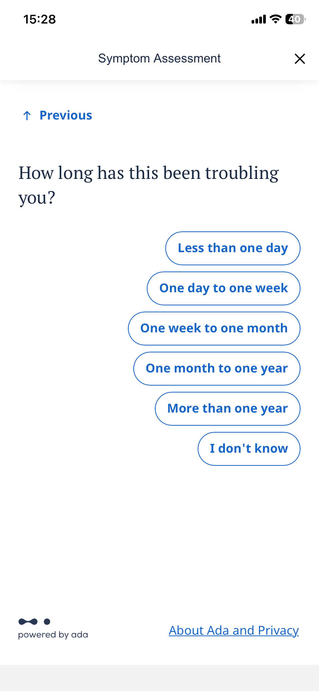

# Template — Evidence Pack

Nộp kèm thin SPEC cuối Day 05.

## 1. Nhóm và track

**Tên nhóm:**  
**Track:**  
**Product/app đã chọn:**  
**Build slice đang nghĩ:**  

## 2. Self-use evidence

| Observation | Screenshot/link | Path liên quan | Điều học được |
|---|---|---|---|
| Nhập triệu chứng sốt + đau họng |  | Low-confidence / Correction | App hỏi thêm nhiều câu, một số câu không liên quan nhưng tổng thể dự đoán khá chính xác. |
| Kết quả gợi ý Flu và COVID-19 |  | Low-confidence / Failure | Dự đoán gần đúng nhưng có thể tạo ra lo lắng với nhiều khả năng bệnh, cần rõ ràng hơn. |


## 3. User / review / social evidence

Nguồn có thể là review App Store/Play, group, comment, phỏng vấn nhanh, hoặc nguồn public khác.

| Quote / review / observation | Nguồn | User là ai? | Pain/failure mode |
|---|---|---|---|
|  |  |  |  |
|  |  |  |  |
|  |  |  |  |

Nếu chưa có nguồn ngoài nhóm, ghi rõ:

```text
Đây là giả định. Nhóm sẽ kiểm bằng [cách] trước checkpoint M1 Day 06.
```

## 4. Competitor / analog evidence

| App / mô hình tham khảo | Họ xử lý task này thế nào? | Pattern học được | Có áp dụng trong 1 ngày không? |
|---|---|---|---|
|  |  |  |  |

## 5. Evidence -> Insight

```text
Evidence nổi bật nhất:

Insight:
User không chỉ gặp [surface problem].
Thật ra họ cần [deeper need / decision support / trust / recovery].

Opportunity:
AI có thể giúp bằng cách [augment/automate hành động hẹp].
```

## 6. Evidence đổi SPEC như thế nào?

- [ ] Đổi user chính.
- [ ] Đổi pain statement.
- [ ] Đổi build slice.
- [ ] Đổi Auto/Aug decision.
- [ ] Đổi 4 paths.
- [ ] Đổi failure mode.
- [ ] Đổi owner/test plan.

Ghi rõ 1-2 thay đổi quan trọng:

```text
Trước evidence, nhóm định...
Sau evidence, nhóm đổi thành...
Lý do:
```