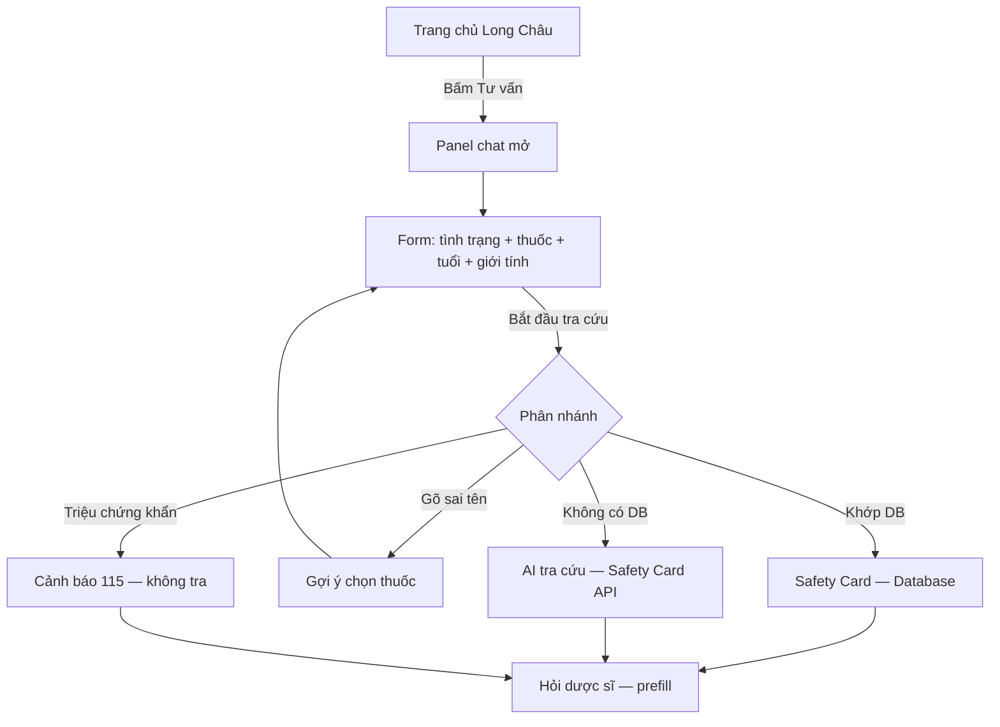

# Mockup Day 06 — Long Châu Safety Bot

> **Checkpoint 11:00:** mockup + prototype chạy được  
> Mockup mô tả **4 màn hình chính** và **4 paths** trong thin SPEC. Prototype thực tế nằm ở `03-prototype/`.

---

## User flow (1 flow lõi)

---

## Màn hình 1 — Trang chủ (background Long Châu)

| Thành phần | Mô tả |
|------------|--------|
| Header xanh | Logo, search, đăng nhập, giỏ hàng |
| Banner | Hero quảng cáo (mock) |
| Quick actions | 6 thẻ: Cần mua thuốc, **Tư vấn dược sĩ**, … |
| Sản phẩm | Grid ưu đãi (mock) |
| **FAB góc phải dưới** | Avatar dược sĩ + nhãn **「Tư vấn」** |

**Wireframe:** xem `03-prototype/mockup/wireframes.html` → màn **S1**

---

## Màn hình 2 — Panel chat (đóng form)

| Thành phần | Mô tả |
|------------|--------|
| Header panel | Long Châu Safety Bot + nút đóng × |
| Form tra cứu | Tình trạng, tên thuốc, tuổi, giới tính |
| Nút chính | **Bắt đầu tra cứu** |
| Demo chips | Panadol / Panadl / Khó thở |
| Chat area | Lời chào bot + hướng dẫn điền form |
| Composer | Input thuốc tiếp theo (sau khi khóa profile) |

**Wireframe:** màn **S2**

---

## Màn hình 3 — Safety Card (happy path)

**Input demo:** `sốt nhẹ` · `Panadol` · 30 tuổi · Nữ

| Thành phần | Mô tả |
|------------|--------|
| Badge | 🟢 / 🟡 / 🔴 |
| Card | Hoạt chất, chỉ định, chống chỉ định, đối chiếu tuổi/giới |
| Nguồn | Database nội bộ hoặc AI |
| Disclaimer | Không thay tư vấn dược sĩ |
| CTA | **Hỏi dược sĩ Long Châu** |

**Wireframe:** màn **S3**

---

## Màn hình 4 — Failure / low-confidence

| Path | UI |
|------|-----|
| **Low-confidence** | Card vàng: "Có thể bạn muốn" + list chọn Paracetamol |
| **Khẩn cấp** | Card đỏ: khó thở → Gọi 115, không tra tự động |
| **Không tìm thấy** | Card vàng + Chat dược sĩ |
| **Đang tra cứu** | Banner xanh + spinner trong chat |

**Wireframe:** màn **S4**

---

## Mapping mockup → prototype

| Mockup | File prototype | Trạng thái |
|--------|----------------|------------|
| S1 Trang chủ + FAB | `index.html` + `styles.css` | ✅ |
| S2 Panel chat + form | `#chat-panel`, `#profile-form` | ✅ |
| S3 Safety Card | `renderSafetyCardFromApi()` | ✅ |
| S4 Failure paths | `handleLookupResult()`, `showUrgentCard()` | ✅ |

---

## Cách nộp evidence Checkpoint 11:00

1. Mở wireframe: `03-prototype/mockup/wireframes.html` → chụp 4 màn S1–S4  
2. Chụp prototype thật: `npm run dev` → http://localhost:3000  
3. Lưu vào `01-invidual-workshop/Evidence/` hoặc `02-group-spec/evidence/`

**Tối thiểu 4 ảnh:** homepage + panel mở + Safety Card + 1 failure path.

---

*Mockup Day 06 · Long Châu Safety Bot · Batch 02*
