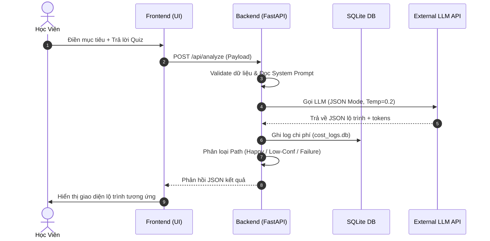

# Kiến Trúc Hệ Thống (Technical Architecture) — AI Learning Path Personalizer

Tài liệu này mô tả chi tiết kiến trúc kỹ thuật của hệ thống **Cá nhân hóa lộ trình học AI cơ bản** (AI Learning Path Personalizer).

## 1. Tổng Quan Hệ Thống (System Overview)

Hệ thống được thiết kế theo mô hình Client-Server gọn nhẹ, tối ưu hóa cho việc tạo mẫu nhanh (prototyping) nhưng vẫn đảm bảo tính an toàn dữ liệu và khả năng giám sát chặt chẽ chi phí API.

```text
                        ┌────────────────────────┐
                        │      WEB BROWSER       │
                        │   (Frontend UI Tab)    │
                        └───────────┬────────────┘
                                    │
                       HTTP POST    │  API Requests
                                    ▼
                        ┌────────────────────────┐
                        │      FASTAPI APP       │
                        │  (Port 8000 Backend)   │
                        └─────┬────────────┬─────┘
                              │            │
             Database Queries │            │ Token Cost Log / Guardrails
                              ▼            ▼
                     ┌──────────┐        ┌────────────────────────────┐
                     │  SQLITE  │        │       MIDDLEWARE & LLM     │
                     │ DATABASES│        │  - Guardrail Rules Engine  │
                     │  (.db)   │        │  - Cost & Token Logger     │
                     └──────────┘        │  - External LLM API        │
                                         └────────────────────────────┘
```

---

## 2. Mô Tả Thành Phần (Component Descriptions)

### A. Frontend (Trình duyệt người dùng)
* **index.html & styles.css:** Giao diện tối màu cao cấp (Glassmorphism UI) tích hợp 2 Tab chính:
  * **Tab 1: Chatbot tư vấn** hỗ trợ hỏi đáp trực tiếp và thảo luận về lộ trình.
  * **Tab 2: Lộ trình học (Visual tree)** kết xuất lộ trình dạng sơ đồ nhánh có thể click thu gọn/mở rộng, tích chọn hoàn thành, hiển thị link tài liệu.
* **app.js:** Xử lý State của ứng dụng, luồng kiểm tra trắc nghiệm 10 câu đầu vào, thực hiện các API Call đến backend, xử lý giới hạn tần suất gửi tin nhắn (Rate limit) phía client.

### B. Backend (FastAPI Web Server)
* **main.py:** Điểm khởi chạy của ứng dụng, cấu hình CORS Middleware và ánh xạ các router API.
* **app/api/analyze.py:** Tiếp nhận thông tin từ form + quiz, chuẩn bị prompt, gọi OpenAI/Gemini API bằng JSON Mode để cấu trúc lộ trình và chấm điểm độ tự tin.
* **app/api/chat.py:** API chat hội thoại, tích hợp kiểm tra bảo mật (Jailbreak / Banned keywords) và kiểm soát tần suất tin nhắn (Rate limit).
* **app/api/feedback.py:** Lưu trữ đánh giá 1-5 sao từ học viên và tự động đẩy các ca đánh giá thấp (1-2 sao) vào hàng đợi quản trị.
* **app/api/admin.py:** Các API dành cho quản trị viên nhằm duyệt hàng đợi sửa lộ trình bằng tay và xem báo cáo tổng hợp chi phí.

### C. Cơ Sở Dữ Liệu & Middleware (Data & Logs)
* **models/database.py:** Thiết lập SQLite với 2 file database độc lập:
  * `cost_logs.db`: Lưu nhật ký tiêu thụ token của từng user, ngày gọi và cờ chặn chi phí ngày.
  * `feedback.db`: Lưu feedback, lịch sử chat và hàng đợi Admin duyệt thủ công (Human-in-the-loop).
* **middleware/cost_logger.py:** Middleware đo lường và ghi lại chi phí. Tính toán chi phí thực tế theo bảng giá của từng model (ví dụ GPT-4o-mini hoặc Gemini 1.5 Flash). Tự động khóa tạm thời nếu chi phí trong ngày của 1 user vượt quá $1.00 USD.

---

## 3. Luồng Dữ Liệu Chính (Data Flow)



---

## 4. Các Biện Pháp Bảo Mật & Phòng Thủ (Security & Safety)

1. **Lớp chặn Prompt Injection:** System prompt được trang bị cơ chế tự bảo vệ nghiêm ngặt để phát hiện hành vi cố tình dò hỏi cấu trúc lệnh hoặc đánh cắp prompt nội bộ. Hệ thống sẽ trả về chuỗi mặc định `[Yêu cầu vi phạm ranh giới bảo mật của hệ thống]` thay vì trả lời.
2. **Bộ lọc Từ Khóa Cấm (Guardrail rules):** Backend phân tích tin nhắn người dùng qua file cấu hình `guardrail_rules.json` chứa các regex chặn mã độc, spam ký tự lặp và các chủ đề nhạy cảm/không liên quan đến học AI.
3. **Ẩn dữ liệu nhạy cảm (Data Masking):** Toàn bộ thông tin định danh cá nhân (Email, Tên thật, SĐT) sẽ được làm mờ (masking) thành dạng ID ẩn danh trước khi gửi lên API LLM bên ngoài để bảo vệ quyền riêng tư của học viên.

---

## 5. Giám Sát Chi Phí API (Cost Monitoring)

Hệ thống tính toán chi phí theo công thức:
$$\text{Total Cost} = (\text{Input Tokens} \times \text{Price}_{\text{In}}) + (\text{Output Tokens} \times \text{Price}_{\text{Out}})$$

**Bảng giá định dạng (Price Table):**
* GPT-4o: $2.5 / $10 (trên 1 triệu tokens)
* GPT-4o-mini: $0.15 / $0.60 (trên 1 triệu tokens)
* Gemini 1.5 Flash: $0.075 / $0.30 (trên 1 triệu tokens)

Nếu tổng chi phí trong ngày hôm nay của user vượt quá `$1.00 USD` (cấu hình qua biến môi trường `MAX_DAILY_COST_USD`), mọi yêu cầu phân tích mới sẽ bị tạm ngưng cho đến ngày tiếp theo.
